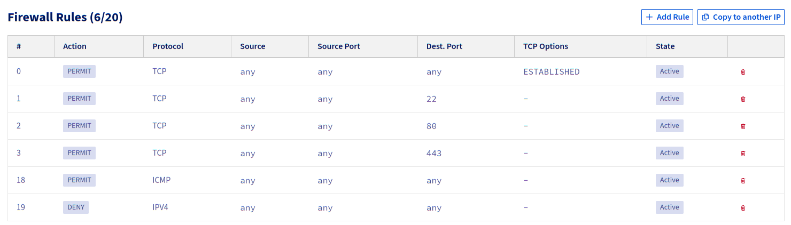

# Infrastructure

Notes on the server infrastructure for nbsp.party!~

## nbsp-party-prod

In OVHcloud the Edge Network Firewall rules are configured to only authorize inbound traffic for TCP ports 22 (SSH), 80 (HTTP) and 443 (HTTPS). ICMP traffic is also authorized (for ping and traceroute). All other inbound traffic is refused.



[UFW on the server](./roles/ufw/tasks/main.yml) itself also only has SSH, HTTP and HTTPS allowed for inbound TCP.

2026-08-23: Added UFW rules to block all Cloudflare IP ranges. There are bots constantly trying to access endpoints like `/wp-admin/install.php`.

<details>
<summary>Bash script to block IP ranges</summary>

```bash
#!/usr/bin/env bash

set -e
set -o pipefail
set -u

# https://www.cloudflare.com/ips/
IP_RANGES=(
    '173.245.48.0/20'
    '103.21.244.0/22'
    '103.22.200.0/22'
    '103.31.4.0/22'
    '141.101.64.0/18'
    '108.162.192.0/18'
    '190.93.240.0/20'
    '188.114.96.0/20'
    '197.234.240.0/22'
    '198.41.128.0/17'
    '162.158.0.0/15'
    '104.16.0.0/13'
    '104.24.0.0/14'
    '172.64.0.0/13'
    '131.0.72.0/22'
    '2400:cb00::/32'
    '2606:4700::/32'
    '2803:f800::/32'
    '2405:b500::/32'
    '2405:8100::/32'
    '2a06:98c0::/29'
    '2c0f:f248::/32'
)

# Add deny rules for each IP range
for IP_RANGE in "${IP_RANGES[@]}"; do
    echo "Adding IP: $IP_RANGE"
    # sudo ufw delete deny from "$IP_RANGE"
    sudo ufw prepend deny from "$IP_RANGE" comment 'Cloudflare'
done
```
</details>
